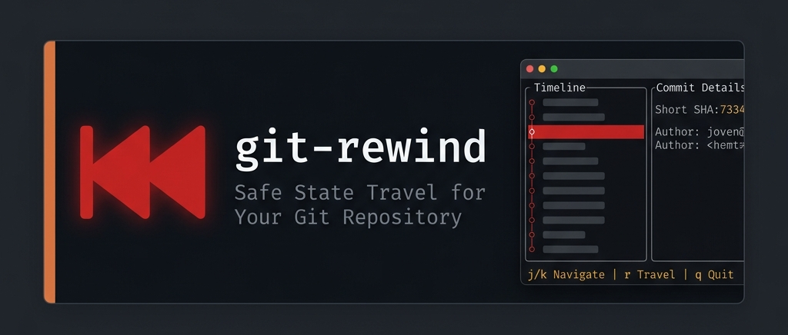
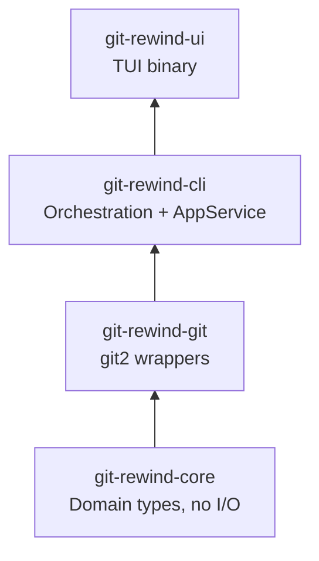
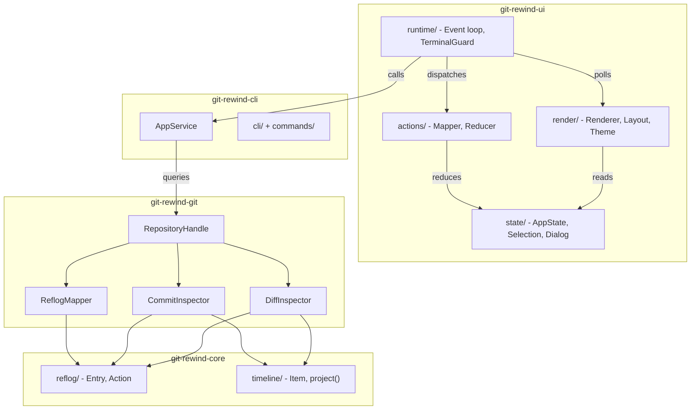
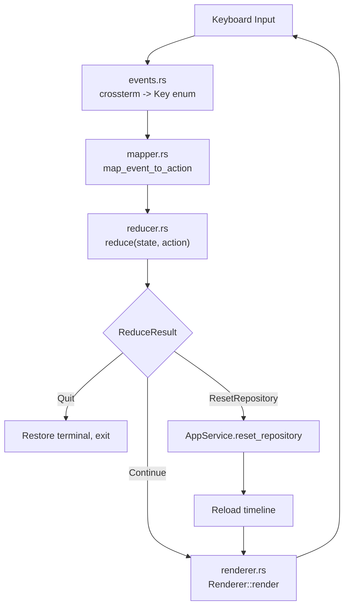
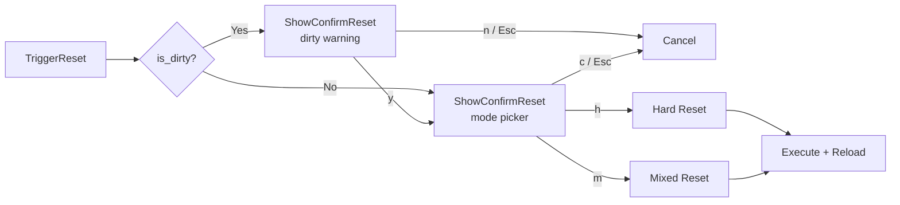

<p align="center">
  
  
  
  
  
  
</p>

<h1 align="center">&#x23EA; git-rewind</h1>
<h3 align="center">Safe, Visual State Travel for Your Git Repository</h3>

<p align="center">
  <i>A terminal-native UI for browsing your Git reflog timeline, inspecting commits, and rewinding to any past state — with dirty-tree warnings and one-key confirmation.</i>
</p>

<p align="center">
  
</p>

---

## Table of Contents

- [Demo](#demo)
- [Overview](#overview)
- [Key Features](#key-features)
- [Quick Start](#quick-start)
- [System Architecture](#system-architecture)
- [Data Flow](#data-flow)
- [Project Structure](#project-structure)
- [Keybindings](#keybindings)
- [Reset Modes](#reset-modes)
- [Test Suite](#test-suite)
- [Tech Stack](#tech-stack)
- [Roadmap](#roadmap)
- [License](#license)

---

## Demo

<p align="center">
  
</p>

```
┌──────────────────────────────────────────────────────────────────┐
│  ╔══════════════════════════════════════════════════════════════╗│
│  ║  Git Rewind — Safe State Travel                              ║│
│  ║  Browse reflog, check diffs, rewind safely.                  ║│
│  ╚══════════════════════════════════════════════════════════════╝│
│  ┌──────────────────────────┐ ┌────────────────────────────────┐ │
│  │ Git Rewind               │ │ Commit Details                 │ │
│  │ ->first commit           │ │ Commit: a1b2c3d [full SHA]     │ │
│  │   second commit          │ │ Author: Name &lt;email&gt;     │ │
│  │   third commit           │ │ Date:   1620000000             │ │
│  │                          │ │                                │ │
│  │                          │ │ message summary here           │ │
│  │                          │ ├────────────────────────────────┤ │
│  │                          │ │ Changed Files                  │ │
│  │                          │ │ [A] src/main.rs                │ │
│  │                          │ │ [M] Cargo.toml                 │ │
│  └──────────────────────────┘ └────────────────────────────────┘ │
│  j/k/Up/Down/Home/End Navigate  |  r/Enter Travel  |  q/Esc Exit │
└──────────────────────────────────────────────────────────────────┘
```

> Run `cargo run --bin git-rewind-ui` from any Git repository to see the live interface.

---

## Overview

`git` has a powerful safety net — the **reflog**. Every commit, checkout, reset, and amend is logged. But navigating it means memorising commands like `git reset --hard HEAD@{3}` with no preview of where you are going.

**git-rewind** makes this visual and interactive. It reads your repository's reflog and presents it as a navigable timeline with commit metadata, file diffs, and a guided multi-step rewind flow that checks for uncommitted changes before it lets you travel.

### Components

| Layer | Crate | Role |
|-------|-------|------|
| **Domain** | `git-rewind-core` | Pure types, reflog entries, timeline projection — zero deps |
| **Git** | `git-rewind-git` | git2 wrappers for reflog reads, diffs, discovery, reset |
| **Orchestration** | `git-rewind-cli` | `AppService`, CLI argument parsing, error bridging |
| **Terminal UI** | `git-rewind-ui` | ratatui rendering, event loop, state, dialogs |

---

## Key Features

- **Reflog Timeline** — Live reflog loaded from your working repository on startup
- **Split-Panel Layout** — Timeline (left), Commit Details + Changed Files (right), footer shortcut bar
- **Commit Inspection** — Full SHA, author, timestamp, and message on selection
- **Color-Coded Diffs** — `[A]` Added (green), `[M]` Modified (yellow), `[D]` Deleted (red), `[R]` Renamed (blue)
- **Dirty Tree Detection** — Blocks rewind when uncommitted changes exist; shows an explicit warning popup
- **Hard & Mixed Reset** — Choose your reset strategy at confirmation time
- **Redux/Elm Architecture** — `Event → Action → Reducer → State → Render`; renderer is a pure read-only function
- **RAII Terminal Safety** — `TerminalGuard` restores raw mode and alternate screen on drop, even during panics
- **24 Tests** — All passing across every crate

---

## Quick Start

### Prerequisites

- **Rust 1.88+** — install via [rustup.rs](https://rustup.rs)
- A Git repository to explore

### Install & Run

```bash
# Clone
git clone https://github.com/Gagandeeprai/git-rewind.git
cd git-rewind

# Build
cargo build --release

# Run from any Git repository
cd /path/to/your/project
cargo run --bin git-rewind-ui
```

### Subcommands

| Command | Effect |
|---------|--------|
| `git-rewind-ui` | Launch interactive TUI (default) |
| `git-rewind-ui version` | Print version information |
| `git-rewind-ui doctor` | Run environment diagnostics |

---

## System Architecture

Dependencies flow inward. No crate depends on a crate above it.



### Internal Module Map



---

## Data Flow

The TUI follows a strict unidirectional architecture. The renderer only reads state; it never mutates it.



### TriggerReset Sequence

When the user presses `r` or `Enter`:



---

## Project Structure

### Workspace Layout

```
git-rewind/
├── Cargo.toml          # Workspace manifest + shared deps
├── rustfmt.toml        # Formatting config
└── crates/
    ├── git-rewind-core/   # Pure domain (no I/O)
    ├── git-rewind-git/    # git2 integration
    ├── git-rewind-cli/    # CLI + AppService orchestration
    └── git-rewind-ui/     # TUI binary
```

### Crate Breakdown

| Crate | Key Types | Responsibilities |
|-------|-----------|-----------------|
| **`git-rewind-core`** | `CommitId`, `ReflogEntry`, `ReflogAction`, `ReflogIndex`, `ReflogTimestamp`, `TimelineItem` | Domain models, pure `project()` transform. Zero external dependencies. |
| **`git-rewind-git`** | `RepositoryHandle`, `GitError`, `CommitDetails`, `CommitAuthor`, `CommitDiff`, `ChangedFile`, `FileChangeType` | Repository discovery, reflog reading, commit inspection, tree-to-tree diff, hard/mixed reset, dirty check. Hides all `git2` types from callers. |
| **`git-rewind-cli`** | `Cli`, `Commands`, `AppService`, `AppError` | CLI argument parsing (clap), `load_timeline()`, `inspect_commit()`, `inspect_diff()`, `reset_repository()`, `is_dirty()`. No `git2` imports, no terminal I/O. |
| **`git-rewind-ui`** | `AppState`, `TimelineState`, `Selection`, `Dialog`, `Action`, `Event`, `Key`, `Renderer`, `Layout`, `Theme`, `TerminalGuard` | Application loop (`run_with_events`), event polling (`poll_event`), context-sensitive mapping, state reduction, ratatui rendering, RAII terminal lifecycle. |

> **Full source tree:** See [`docs/architecture.md`](docs/architecture.md) for the complete annotated file tree and dependency reference.

---

## Keybindings

| Context | Key | Action |
|---------|-----|--------|
| Normal | `j` / `Down` | Select next commit |
| Normal | `k` / `Up` | Select previous commit |
| Normal | `g` / `Home` | Jump to first commit (HEAD) |
| Normal | `G` / `End` | Jump to last commit |
| Normal | `r` / `Enter` | Initiate rewind |
| Normal | `q` | Quit application |
| Normal | `Esc` | Clear error state |
| Dirty warning | `y` | Acknowledge, proceed to mode picker |
| Dirty warning | `n` / `Esc` / `c` | Cancel |
| Mode picker | `h` | **Hard Reset** — discard uncommitted changes |
| Mode picker | `m` | **Mixed Reset** — preserve changes in working tree |
| Mode picker | `c` / `Esc` | Cancel |

---

## Reset Modes

| Mode | Git Equivalent | Behaviour |
|------|---------------|-----------|
| **Hard** | `git reset --hard <commit>` | Moves HEAD to the selected commit. Discards **all** staged and unstaged changes. Working tree matches that commit exactly. |
| **Mixed** | `git reset --mixed <commit>` | Moves HEAD to the selected commit. Preserves file changes as unstaged modifications. Staged changes return to the working tree. |

> **Safety:** git-rewind always checks `is_dirty()` before allowing a rewind. If uncommitted changes exist, you must explicitly acknowledge the warning before choosing a reset mode.

---

## Test Suite

```bash
cargo test --workspace
```

| Crate | Tests | Highlighted Coverage |
|-------|:-----:|----------------------|
| `git-rewind-core` | 7 | Wrapper display impls, empty/single/multiple projection, summary trimming, unknown action round-trip |
| `git-rewind-git` | 7 | Repository discovery (missing/root/nested), commit inspection, root/merge/invalid diff, rename detection |
| `git-rewind-cli` | 4 | Timeline loading, commit inspection, diff inspection, error propagation |
| `git-rewind-ui` | 6 | Selection invariants, timeline state transitions, event translation, context-sensitive key mapping, reducer bounds, full dialog flow |
| **Total** | **24** | **All passing** |

The dialog test validates the complete dirty-warning → mode-picker → reset-execution pipeline as a single end-to-end flow.

---

## Tech Stack

| Layer | Technology | Version |
|-------|-----------|---------|
| Language | Rust | 1.88+ |
| TUI Framework | ratatui | 0.29 |
| Terminal Backend | crossterm | 0.28 |
| Git Bindings | git2 (libgit2) | 0.21 |
| CLI Parser | clap (derive) | 4.5 |
| Error Handling | anyhow + thiserror | 1.x |
| Build System | Cargo workspace | resolver = "2" |
| Testing | tempfile | 3.x |

---

## Roadmap

- [ ] **Scrollable viewport** — `ListState` pagination for large reflogs
- [ ] **Reflog search / filter** — Live-filter by message or commit ID prefix
- [ ] **Branch awareness** — Show branch context per reflog entry
- [ ] **Stash integration** — Auto-stash dirty changes before hard reset
- [ ] **Undo rewind** — Record pre-rewind HEAD; one-key undo
- [ ] **Mouse support** — Click to select, scroll wheel
- [ ] **`git rewind` subcommand** — Ship as a proper Git extension
- [ ] **Configuration file** — `~/.config/git-rewind/config.toml`
- [ ] **Multiple themes** — Dark / light / high-contrast variants

---

## License

MIT License. See [LICENSE](LICENSE) for details.

---

<p align="center">
  <b>Built with &#x23EA;&#x1F980; in Rust</b><br/>
  <i>Because <code>git reflog</code> deserves a better interface.</i>
</p>
