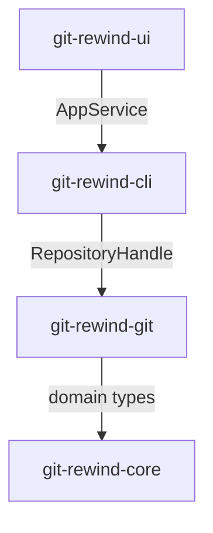

# Architecture Reference

## Source Tree

```
git-rewind/
├── Cargo.toml                  # Workspace manifest + shared dependencies
├── rustfmt.toml                # Code formatting config
├── .editorconfig               # Editor settings
├── .gitignore                  # Git ignore rules
│
├── crates/
│   │
│   ├── git-rewind-core/        # Pure domain types (no I/O)
│   │   ├── Cargo.toml
│   │   └── src/
│   │       ├── lib.rs          # Module declarations
│   │       ├── reflog/
│   │       │   ├── mod.rs      # Public re-exports
│   │       │   ├── entry.rs    # CommitId, ReflogEntry, ReflogTimestamp
│   │       │   └── action.rs   # ReflogAction enum + From<&str>
│   │       └── timeline/
│   │           ├── mod.rs      # Public re-exports
│   │           ├── item.rs     # TimelineItem (presentation model)
│   │           └── projector.rs# project(entries) -> Vec<TimelineItem>
│   │
│   ├── git-rewind-git/         # git2 integration layer
│   │   ├── Cargo.toml
│   │   └── src/
│   │       ├── lib.rs          # Module declarations
│   │       ├── repository.rs   # RepositoryHandle, discover(), reset(), is_dirty()
│   │       ├── error.rs        # GitError enum
│   │       ├── reflog/
│   │       │   ├── mod.rs      # read_reflog()
│   │       │   └── mapper.rs   # git2 reflog -> domain ReflogEntry
│   │       ├── commit/
│   │       │   ├── mod.rs      # Re-exports
│   │       │   ├── model.rs    # CommitDetails, CommitAuthor
│   │       │   └── inspector.rs# inspect(repo, id) -> CommitDetails
│   │       └── diff/
│   │           ├── mod.rs      # Re-exports
│   │           ├── model.rs    # CommitDiff, ChangedFile, FileChangeType
│   │           └── inspector.rs# inspect(repo, id) -> CommitDiff
│   │
│   ├── git-rewind-cli/         # Orchestration & CLI parsing
│   │   ├── Cargo.toml
│   │   └── src/
│   │       ├── main.rs         # Entry point
│   │       ├── lib.rs          # Module declarations
│   │       ├── cli.rs          # Cli struct, Commands enum (clap derive)
│   │       ├── commands/
│   │       │   ├── mod.rs
│   │       │   ├── version.rs  # `git-rewind version`
│   │       │   └── doctor.rs   # `git-rewind doctor`
│   │       └── app/
│   │           ├── mod.rs      # Re-exports
│   │           ├── model.rs    # AppError
│   │           └── service.rs  # AppService
│   │
│   ├── git-rewind-ui/          # TUI binary
│   │   ├── Cargo.toml
│   │   └── src/
│   │       ├── main.rs         # Entry point (discover repo, load timeline, run TUI)
│   │       ├── lib.rs          # Module declarations + integration tests
│   │       ├── state/
│   │       │   ├── mod.rs      # Re-exports
│   │       │   ├── app.rs      # AppState, Dialog enum
│   │       │   ├── selection.rs# Selection (clamped index)
│   │       │   └── timeline.rs # TimelineState, LoadingStatus
│   │       ├── actions/
│   │       │   ├── mod.rs      # Re-exports
│   │       │   ├── action.rs   # Action enum
│   │       │   ├── mapper.rs   # map_event_to_action(event, &state)
│   │       │   └── reducer.rs  # reduce(&mut state, action) -> ReduceResult
│   │       ├── runtime/
│   │       │   ├── mod.rs      # Re-exports
│   │       │   ├── application.rs# run(), run_with_events()
│   │       │   ├── events.rs   # Event/Key enums, poll_event(), translate_event()
│   │       │   └── terminal.rs # TerminalGuard (RAII)
│   │       └── render/
│   │           ├── mod.rs      # Re-exports
│   │           ├── renderer.rs # Renderer::render()
│   │           ├── layout.rs   # compute(area) -> Layout
│   │           ├── timeline.rs # Timeline list widget
│   │           └── theme.rs    # DEFAULT_THEME
│   │
│   └── paste-patch/            # Vendored patched `paste` crate
│       ├── Cargo.toml
│       ├── build.rs            # Handles cfg(no_literal_fromstr)
│       └── src/
│           ├── lib.rs
│           ├── attr.rs
│           ├── error.rs
│           └── segment.rs
```

## Dependency Graph



## Data Flow


## Reset Mode Reference

| Mode | Git Command | Behaviour |
|------|-------------|-----------|
| Hard | `git reset --hard <commit>` | Discards staged + unstaged changes |
| Mixed | `git reset --mixed <commit>` | Preserves changes as unstaged modifications |
